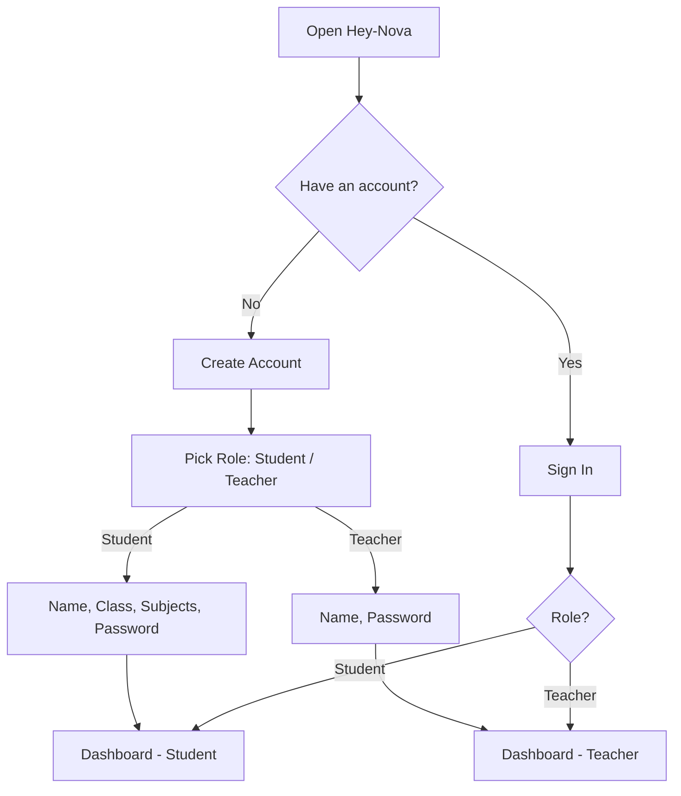
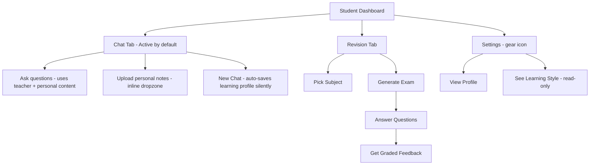
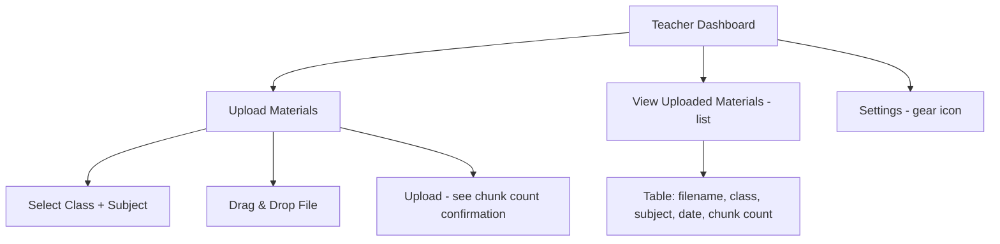

# Student Copilot — Frontend Redesign: User Stories, Flow & Spec

---

## 1. User Stories

### Teacher: Mrs. Adeyemi (Biology, SSS 1-3)

> "I need to upload my biology syllabus once and have all my students across three classes access it for study, revision, and exams — without managing any tech."

**Journey:**
1. Opens Hey-Nova → **"Create Account"** → picks **Teacher** → enters name, password
2. Lands on a clean **Dashboard** showing: upload area, list of uploaded materials, class stats
3. Drags a PDF syllabus → selects Class: `SSS 1`, Subject: `Biology` → clicks **Upload**
4. Sees confirmation: *"Biology syllabus uploaded — 47 study sections created for SSS 1"*
5. Uploads another file for `SSS 2 / Chemistry`
6. Logs out. Never touches the app again until next term.

**Key insight**: Teachers are low-frequency users. The UI must be dead simple — upload, confirm, done. No jargon. No dashboards they'll never read.

---

### Student: Victor (SSS 1, Biology + Math)

> "I want to study for my biology exam using my teacher's materials, ask questions when I'm stuck, and test myself — all in one place."

**Journey:**
1. Opens Hey-Nova → **"Create Account"** → picks **Student** → enters name, class, subjects, password
2. Lands on a clean **Chat** screen. A welcome message says: *"Hi Victor! I'm your study copilot. What would you like to work on today?"*
3. Types: *"Help me understand photosynthesis"*
4. Copilot responds using Mrs. Adeyemi's uploaded biology content + adaptive teaching based on Victor's learning style
5. Victor uploads his own handwritten notes (photo/PDF) for personal study
6. Switches to **Revision** tab → picks Biology → gets a personalized exam
7. Submits answers → gets graded feedback explaining mistakes in *his* learning style
8. Closes the chat. **Learning style analysis runs automatically in the background** — no button needed.
9. Next session, Copilot remembers how Victor learns and adapts accordingly.

**Key insight**: Students don't think in "modes." They think in goals: *study, ask, test*. The UI should feel like a single intelligent tutor, not three separate tools bolted together.

---

### Interaction Model

```
Teacher uploads syllabus ──→ Pinecone (global vectors)
                                    │
Student asks question ──→ Copilot searches ──┤
                                    │
                        Student's own uploads (personal vectors)
                                    │
                        Student's learning profile (Supabase)
                                    ↓
                            Adaptive answer
```

The student never needs to know about Pinecone, vectors, or "modes." Copilot just *knows*.

---

## 2. UX Problems in Current Frontend

| Problem | Impact | Fix |
|---|---|---|
| "Sovereign Login", "Establish Context", "Sovereign Registry" | Alienates normal users | → "Sign In", "Create Account" |
| "Student OS Online" | Meaningless to users | → "Hi {name}! What are you studying today?" |
| "End Session & Sync Mind" | Confusing, required for learning analysis | → Auto-sync on chat close/new chat |
| "Query the sovereign context..." | Jargon | → "Ask me anything..." |
| Profile fields visible in sidebar | Privacy violation for shared screens/labs | → Hidden behind Settings icon, no PII visible by default |
| Three separate "modes" (Tutor/Notebook/Revision) | Forces users to understand system architecture | → Single chat with smart tabs |
| No onboarding or welcome | Cold, hostile first impression | → Welcome message + contextual hints |
| Teacher portal is bare bones | Feels unfinished | → Clean upload dashboard with material list |
| "Analyzing Vectors & Generating Exam" | Exposes internals | → "Preparing your exam..." |
| Alert popups for everything | Jarring UX | → Inline toast notifications |

---

## 3. Proposed User Flow

### Registration / Login



### Student Flow



### Teacher Flow



---

## 4. Frontend Architecture Spec

### Screen 1: Auth Screen
- **Title**: "Student Copilot" (logo) 
- **Tabs**: Sign In | Create Account
- **Sign In**: Username + Password + Submit
- **Create Account**: Role toggle (Student / Teacher) → conditional fields → Submit
- **Language**: Plain English. No "sovereign", no "context", no "registry".
- **Error messages**: Inline under fields, not alerts.

### Screen 2: Student Dashboard
A single-page layout with a **top nav bar** and **content area**.

**Top Nav:**
```
[Copilot Logo]     [Chat]  [Revision]     [⚙️]  [Logout]
```
- No user PII visible. Just the logo, tabs, gear icon, logout.
- Active tab is highlighted.

**Chat View (default):**
- Full-width chat area.
- Welcome: *"Hi Victor! What would you like to study today?"*
- Input: *"Ask me anything..."*
- **New Chat** button (top-right of chat). Auto-triggers learning profile sync in background.
- **Upload** button (paperclip icon next to input). Inline — no sidebar needed.
- Subject selector dropdown above chat (picks which subject context to use). **Required**.
- Messages render with full markdown/math support.

**Revision View:**
- Clean form: Subject (dropdown from enrolled subjects) → Generate Exam
- Exam renders as scrollable cards with MCQ radios + theory textareas
- Submit → Grading feedback with markdown rendering
- "New Exam" button to reset

**Settings Modal (gear icon):**
- Profile info (read-only for most fields)
- Learning Style (read-only, auto-populated)
- Logout

### Screen 3: Teacher Dashboard
Minimal. Upload-focused.

**Top Nav:**
```
[Copilot Logo]     [Upload]  [Materials]     [⚙️]  [Logout]
```

**Upload View (default):**
- Class ID dropdown/input
- Subject input
- Drag-and-drop file zone
- Upload button
- Inline success/error toasts (not alerts)

**Materials View:**
- Table listing all uploaded files: Filename, Class, Subject, Date, Sections Created
- (Future: delete button per row)

---

## 5. Learning Profile Auto-Sync Spec

### Current Problem
Learning style only updates when user manually clicks "End Session & Sync Mind." Most users will never click it.

### Proposed Solution
Learning profile analysis runs **automatically** and **silently** whenever:

1. **New Chat is created** (previous chat's messages get analyzed)
2. **User logs out** (current chat analyzed before session destroy)
3. **Tab/browser is closed** (via `beforeunload` event → fire-and-forget API call)
4. **Revision exam is submitted** (grading feedback includes learning insights)

**Backend change**: The `/conversations/{id}/end` endpoint already does the analysis. We just need to call it automatically from the frontend instead of requiring a manual button click.

**Cross-mode learning**: The learning profile is stored per-user (not per-conversation or per-mode). It already applies to General Tutor, Notebook Oracle, and Revision grading. The only missing piece is *triggering the update* from all modes — not just general chat.

### Implementation
- Frontend: Call `POST /conversations/{id}/end` silently (no alert) when creating a new chat or switching away
- Frontend: Add `beforeunload` listener to fire the call on tab close
- Backend: After revision evaluation, also trigger a learning method update using the grading feedback
- Frontend: Remove "End Session & Sync Mind" button entirely

---

## 6. Privacy Hardening

| Surface | Current | Proposed |
|---|---|---|
| Sidebar | Shows name, age, country, grade | → Remove all PII from default view |
| Settings modal | Shows editable profile fields | → Read-only display, no edit in production |
| Chat messages | No PII in messages | ✅ Already clean |
| localStorage | Stores `current_user`, `current_role`, JWT | → Fine, but add logout-on-tab-close option |
| URL bar | No PII in URLs | ✅ Already clean |
| Error messages | Some expose internal details | → Generic user-facing errors |

---

## 7. Design Language

### Do
- "Sign In" / "Create Account"
- "Ask me anything..."
- "Preparing your exam..."
- "Upload your notes"
- "Hi {name}!"
- "Your exam is ready"
- "Generating feedback..."

### Don't
- ~~"Sovereign Login"~~ / ~~"Establish Context"~~
- ~~"Query the sovereign context"~~
- ~~"Analyzing Vectors & Generating Exam"~~
- ~~"Ingest to Global Index"~~
- ~~"Student OS Online"~~
- ~~"End Session & Sync Mind"~~
- ~~"Processing vector logic"~~
- ~~"Initialize Revision Session"~~

---

## 8. Visual Direction

- **Dark mode** (keep current dark palette — it's good)
- **Glassmorphism** cards with subtle blur (keep)
- **Gradient accents** on primary actions (keep indigo→violet)
- **Clean sans-serif** typography (Inter — keep)
- **Minimal chrome**: No sidebars. Top nav + content only.
- **Mobile-first**: Single column layout that works on phones
- **Micro-animations**: Fade-in messages, smooth transitions between tabs
- **Empty states**: Friendly illustrations or messages when no content exists yet

---

## Summary: What Changes

| Layer | Scope |
|---|---|
| **Auth Screen** | Rewrite — clean language, inline errors |
| **Student Layout** | Rewrite — top nav, no sidebar, subject selector |
| **Chat UX** | Refine — welcome message, inline upload, auto-sync |
| **Revision UX** | Refine — scrollable, subject from enrolled list |
| **Teacher Portal** | Rewrite — upload dashboard + materials list |
| **Settings** | Rewrite — modal, no PII in default view |
| **Learning Sync** | Backend + Frontend — automatic, silent, cross-mode |
| **Language** | Global sweep — remove all jargon |
